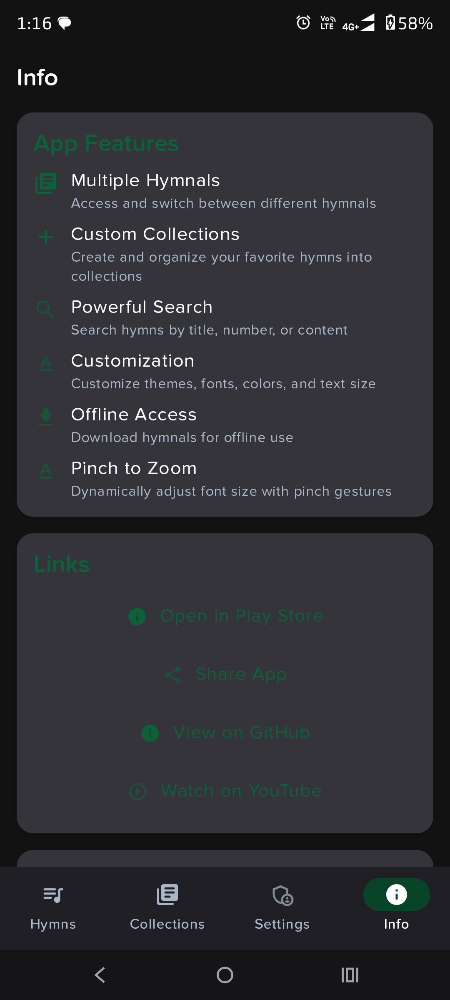
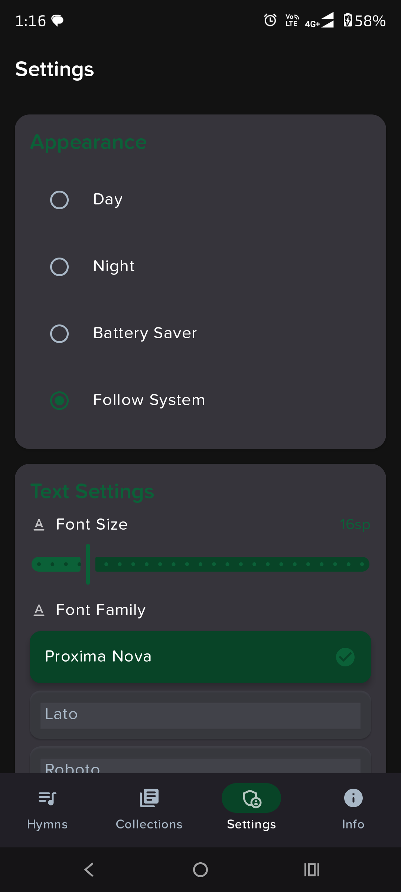
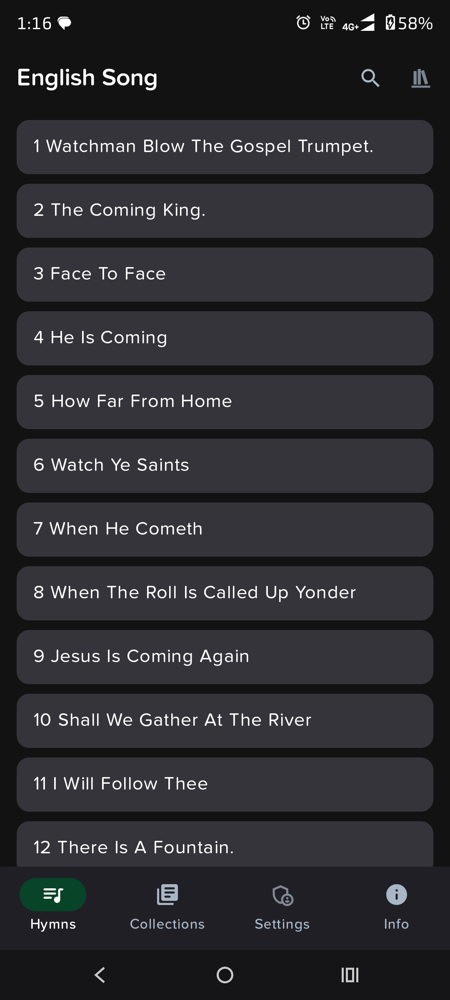
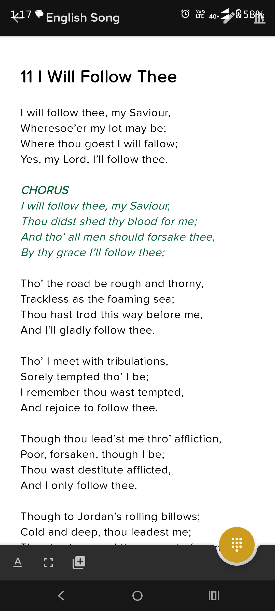

# KCC Labu Android App

[](.github/workflows/workflow.yml)
[](https://ktlint.github.io/)

A comprehensive hymn application built with modern Android technologies, featuring multiple hymnals, custom collections, offline access, and extensive customization options.

**[Install on Google Play](https://play.google.com/store/apps/details?id=com.kholhang.kcclabu)**

## Screenshots


---

## 📱 App Features

### Core Features

#### 1. **Multiple Hymnals Support**
- Access and switch between different hymnals
- Support for multiple languages (English, CIS, Kukisong, etc.)
- Local hymnals stored in JSON format (`mtl_XXX_*.json`)
- Remote hymnals via Firebase Realtime Database
- Offline access to downloaded hymnals

#### 2. **Custom Collections**
- Create unlimited custom hymn collections
- Organize favorite hymns into personalized collections
- Add/remove hymns from collections
- Edit collection names and descriptions
- Swipe-to-delete functionality for collections
- View collection contents with hymn details

#### 3. **Powerful Search**
- Search hymns by title, number, or content
- Real-time search filtering
- Search across all hymnals
- Search within collections
- Fast, efficient search algorithm

#### 4. **Hymn Viewing & Presentation**
- **Sing Mode**: Full-screen hymn viewing with navigation
- **Present Mode**: Landscape presentation mode for public display
- **Edit Mode**: Edit hymn content with rich text support
- ViewPager2 for smooth hymn navigation
- Verse-by-verse display
- MIDI tune playback support
- Pinch-to-zoom for dynamic font size adjustment

#### 5. **Extensive Customization**
- **Themes**: Light, Dark, and System default themes
- **Fonts**: Multiple font options:
  - Lato
  - Andada
  - Roboto
  - Gentium Basic
  - Proxima Nova Soft
- **Text Size**: Adjustable from 14sp to 30sp
- **Text Formatting**: Custom text styles and formatting options
- **Color Schemes**: Material Design 3 dynamic color support

#### 6. **Offline Access**
- Download hymnals for offline use
- Local storage using Room database
- Offline indicator for downloaded content
- Seamless online/offline switching

#### 7. **MIDI Playback**
- Play MIDI tunes for hymns
- MediaPlayer integration
- Playback controls (play, stop)
- Lifecycle-aware playback management
- Automatic pause on app background

#### 8. **Number Pad Navigation**
- Quick hymn number input
- Floating Action Button (FAB) number pad
- Direct navigation to hymn by number
- Smooth animations and transitions

#### 9. **Support & Donations**
- In-app purchase support via Google Play Billing
- One-time donations
- Recurring subscriptions
- ProductDetails API (modern billing implementation)

#### 10. **Settings & Preferences**
- Persistent user preferences
- Theme selection
- Font preferences
- Text size preferences
- App information and links

---

## 🏗️ Architecture & Design Patterns

### Architecture Pattern
- **MVVM (Model-View-ViewModel)**: Clean architecture separation
- **Repository Pattern**: Centralized data management
- **Dependency Injection**: Hilt for dependency management

### UI Architecture
- **Jetpack Compose**: Modern declarative UI framework
- **View Binding**: For XML layouts (legacy support)
- **Material Design 3**: Latest Material Design components
- **Navigation Component**: Type-safe navigation with Compose

### Data Flow
```
UI (Compose Screens) 
  ↓
ViewModel (State Management)
  ↓
Repository (Data Layer)
  ↓
Data Sources (Room DB / Firebase / Local JSON)
```

---

## 📚 Libraries & Dependencies

### Core Android Libraries

#### Jetpack Compose
- **Compose BOM**: `2024.12.01` - Bill of Materials for Compose libraries
- **Compose UI**: Core UI components and toolkit
- **Compose Material3**: Material Design 3 components
- **Compose Navigation**: Navigation component for Compose
- **Compose Runtime LiveData**: LiveData integration with Compose
- **Compose Compiler**: `1.5.15` - Kotlin compiler extension

#### AndroidX Core Libraries
- **Core KTX**: `1.15.0` - Kotlin extensions for Android
- **AppCompat**: `1.7.0` - Backward compatibility
- **Material Components**: `1.13.0` - Material Design components
- **ConstraintLayout**: `2.2.0` - Advanced layout system
- **RecyclerView**: `1.3.2` - Efficient list rendering
- **Preference KTX**: `1.2.1` - Settings and preferences
- **Browser**: `1.9.0` - Custom tabs and browser integration

#### Lifecycle & Architecture Components
- **Lifecycle**: `2.8.7` - Lifecycle-aware components
  - `lifecycle-viewmodel-ktx`: ViewModel support
  - `lifecycle-livedata-ktx`: LiveData support
  - `lifecycle-runtime-ktx`: Runtime components
  - `lifecycle-common-java8`: Java 8 support
  - `lifecycle-viewmodel-compose`: Compose ViewModel integration
  - `lifecycle-runtime-compose`: Compose runtime integration

#### Navigation
- **Navigation Compose**: `2.8.2` - Navigation for Compose
- **Navigation Safe Args**: Type-safe navigation arguments
- **Hilt Navigation Compose**: Hilt integration with Navigation

#### Room Database
- **Room Runtime**: `2.6.1` - Local SQLite database
- **Room KTX**: Kotlin coroutines support
- **Room Compiler**: Annotation processor (Kapt)

#### Startup
- **Startup Runtime**: `1.2.0` - App initialization library

### Dependency Injection

#### Hilt (Dagger)
- **Hilt Android**: `2.51.1` - Dependency injection framework
- **Hilt AndroidX**: `1.1.0` - AndroidX integration
- **Hilt Compiler**: Annotation processor

### Firebase Services

- **Firebase Storage KTX**: `21.0.0` - Cloud storage for hymnals
- **Firebase Auth KTX**: `23.0.0` - User authentication
- **Firebase Database KTX**: `21.0.0` - Realtime database
- **Firebase Analytics KTX**: `22.0.0` - Usage analytics
- **Firebase Crashlytics**: `19.0.0` - Crash reporting

### Data Serialization

- **Moshi**: `1.15.1` - JSON parsing and serialization
  - `moshi-kotlin`: Kotlin support
  - `moshi-kotlin-codegen`: Code generation (Kapt)

### Asynchronous Programming

- **Kotlin Coroutines**: `1.9.0`
  - `kotlinx-coroutines-core`: Core coroutines
  - `kotlinx-coroutines-android`: Android-specific coroutines

### Google Play Services

- **Play Billing KTX**: `7.1.1` - In-app purchases and subscriptions
  - Uses modern ProductDetails API
  - Supports one-time purchases and subscriptions

### Logging

- **Timber**: `5.0.1` - Advanced logging framework
  - Custom CrashlyticsTree for crash reporting integration

### Testing Libraries

#### Unit Testing
- **JUnit**: `4.13.2` - Unit testing framework
- **Mockito**: `5.11.0` - Mocking framework
- **Kluent**: `1.68` - Fluent assertion library
- **Architecture Core Testing**: `2.2.0` - Testing architecture components
- **Coroutines Test**: Testing coroutines

#### Instrumented Testing
- **Espresso**: `3.6.1` - UI testing framework
- **AndroidX JUnit**: `1.2.1` - Android JUnit extensions
- **Robolectric**: `4.15` - Unit testing for Android
- **Compose Testing**: `1.6.6` - Compose UI testing

### Code Quality

- **ktlint**: `0.50.0` - Kotlin code style checker

---

## 🔧 Build Configuration

### Android Configuration
- **Minimum SDK**: `26` (Android 8.0 Oreo)
- **Target SDK**: `36` (Android 15)
- **Compile SDK**: `36`
- **Java Version**: `17`
- **Kotlin Version**: `1.9.25`
- **Gradle Plugin**: `8.7.3`

### Build Features
- **Jetpack Compose**: Enabled
- **View Binding**: Enabled
- **Build Config**: Enabled
- **Data Binding**: Enabled

### Build Types
- **Debug**: Development builds
- **Release**: 
  - Minification enabled
  - Resource shrinking enabled
  - ProGuard rules applied

---

## 🎨 UI/UX Features

### Material Design 3
- Dynamic color theming
- Material You color schemes
- Adaptive layouts
- Material 3 components (Cards, Buttons, Chips, etc.)

### Animations
- Slide animations (left, right, up, down)
- Fade animations
- Raise animations
- Smooth transitions between screens

### Custom Components
- **ZoomableNestedScrollView**: Pinch-to-zoom functionality
- **NumberPadView**: Custom number input pad
- **FadingSnackbar**: Custom snackbar with fade animation
- **ScrollAwareFABBehavior**: FAB that hides on scroll
- **SwipeToDeleteCallback**: Swipe gesture for deletion

### Responsive Design
- Support for different screen sizes
- Tablet-optimized layouts (`values-w500dp`)
- Landscape orientation support
- Adaptive icons (API 26+)

---

## 💾 Data Management

### Local Storage
- **Room Database**: SQLite-based local database
  - Hymnals table
  - Hymns table
  - Collections table
  - Collection-Hymn cross-reference table
- **SharedPreferences**: User preferences and settings
- **Raw Resources**: Local JSON hymnal files

### Remote Storage
- **Firebase Realtime Database**: Remote hymnal metadata
- **Firebase Storage**: Hymnal JSON files storage
- **Firebase Auth**: User authentication (optional)

### Data Models
- **Hymnal**: Collection of hymns with metadata
- **Hymn**: Individual hymn with verses and metadata
- **Collection**: User-created hymn collections
- **RemoteHymnal**: Remote hymnal metadata
- **RemoteHymn**: Remote hymn data structure

---

## 🔐 Permissions

The app requires **NO runtime permissions** for core functionality. All features work without requesting permissions.

Optional features that may require permissions (if implemented):
- Network access (for Firebase sync)
- Storage access (for downloading hymnals)

---

## 🚀 Key APIs & Technologies

### Android APIs Used

#### Core Android APIs
- **Activity Result API**: Modern activity result handling
- **OnBackPressedDispatcher**: Modern back button handling
- **WindowInsetsControllerCompat**: System UI control
- **NetworkCapabilities**: Modern network connectivity checking
- **MediaPlayer**: MIDI playback
- **Parcelable**: Type-safe data passing between components

#### Lifecycle APIs
- **DefaultLifecycleObserver**: Lifecycle-aware components
- **LifecycleOwner**: Lifecycle management
- **ViewModel**: UI-related data holder

#### Navigation APIs
- **Navigation Compose**: Declarative navigation
- **NavController**: Navigation control
- **Type-safe arguments**: Safe navigation with typed arguments

#### Database APIs
- **Room Persistence Library**: Local database
- **Flow**: Reactive data streams
- **Coroutines**: Asynchronous database operations

### Firebase APIs
- **Firebase Realtime Database**: Real-time data synchronization
- **Firebase Storage**: Cloud file storage
- **Firebase Auth**: User authentication
- **Firebase Analytics**: Usage tracking
- **Firebase Crashlytics**: Crash reporting

### Google Play APIs
- **Play Billing Library**: In-app purchases
  - ProductDetails API (modern)
  - Purchase flow management
  - Subscription management

### Kotlin Features
- **Coroutines**: Asynchronous programming
- **Flow**: Reactive streams
- **Sealed Classes**: Type-safe state management
- **Extension Functions**: Utility extensions
- **Data Classes**: Immutable data models
- **Parcelize**: Automatic Parcelable implementation

---

## 📂 Project Structure

```
app/src/main/
├── java/com/kholhang/kcclabu/
│   ├── data/
│   │   ├── db/              # Room database (DAOs, entities, database)
│   │   ├── di/              # Dependency injection modules
│   │   ├── model/           # Data models
│   │   └── repository/      # Data repositories
│   ├── extensions/          # Kotlin extension functions
│   ├── initializer/         # App initialization
│   ├── ui/                  # UI components
│   │   ├── collections/     # Collections feature
│   │   ├── hymns/           # Hymns feature
│   │   ├── screens/         # Compose screens
│   │   ├── settings/        # Settings
│   │   ├── support/         # Support/donations
│   │   └── theme/           # Theme configuration
│   ├── utils/               # Utility functions
│   └── HymnalApp.kt         # Application class
├── res/
│   ├── layout/              # XML layouts (legacy)
│   ├── values/              # Resources (strings, colors, etc.)
│   ├── font/                # Custom fonts
│   ├── drawable/            # Drawable resources
│   └── raw/                 # Local JSON hymnal files
└── AndroidManifest.xml
```

---

## 🛠️ Development Setup

### Prerequisites
- Android Studio Hedgehog or later
- JDK 17 or higher
- Android SDK with API 26-36
- Gradle 8.9+

### Setup Steps

1. **Clone the repository**
   ```bash
   git clone https://github.com/kholhangconnect/kcclabu.git
   cd kcclabu
   ```

2. **Open in Android Studio**
   - Open the project in Android Studio
   - Sync Gradle files

3. **Configure Firebase (Optional)**
   - Add `google-services.json` to `app/` directory
   - Firebase features will be enabled automatically

4. **Build the project**
   ```bash
   ./gradlew assembleDebug
   ```

5. **Run the app**
   - Connect an Android device or start an emulator
   - Click Run in Android Studio

---

## 🧪 Testing

### Running Tests

**Unit Tests:**
```bash
./gradlew test
```

**Instrumented Tests:**
```bash
./gradlew connectedAndroidTest
```

**All Tests:**
```bash
./gradlew check
```

### Test Coverage
- ViewModel tests
- Repository tests
- Utility function tests
- UI component tests (Compose)

---

## 📦 Building APK

### Debug APK
```bash
./gradlew assembleDebug
```
Output: `app/build/outputs/apk/debug/app-debug.apk`

### Release APK
```bash
./gradlew assembleRelease
```
Output: `app/build/outputs/apk/release/app-release.apk`

**Note**: Release builds require signing configuration in `keystore.properties`

---

## 🔄 Migration & Updates

### API Migrations Completed
- ✅ Migrated to ProductDetails API (Billing Library)
- ✅ Migrated to Activity Result API
- ✅ Migrated to OnBackPressedDispatcher
- ✅ Migrated to typed Parcelable APIs
- ✅ Migrated to DefaultLifecycleObserver
- ✅ Removed all deprecated APIs
- ✅ API 26+ baseline established

### Modern APIs in Use
- All APIs are using latest long-term supported versions
- No deprecated APIs in use
- Future-proof architecture

---

## 📝 Code Style

The project uses **ktlint** for code style enforcement:
- Kotlin coding conventions
- Consistent formatting
- Automatic code style checking

Run ktlint:
```bash
./gradlew ktlintCheck
```

Auto-fix:
```bash
./gradlew ktlintFormat
```

---

## 🤝 Contributing

Contributions are welcome! Please follow these guidelines:
1. Fork the repository
2. Create a feature branch
3. Make your changes
4. Ensure all tests pass
5. Run ktlint
6. Submit a pull request

---

## 📄 License

```
Copyright 2024 Kholhang Connect

Licensed under the Apache License, Version 2.0 (the "License");
you may not use this file except in compliance with the License.
You may obtain a copy of the License at

   http://www.apache.org/licenses/LICENSE-2.0

Unless required by applicable law or agreed to in writing, software
distributed under the License is distributed on an "AS IS" BASIS,
WITHOUT WARRANTIES OR CONDITIONS OF ANY KIND, either express or implied.
See the License for the specific language governing permissions and
limitations under the License.
```

---

## 🙏 Acknowledgments

- Built with modern Android development best practices
- Uses Material Design 3 for beautiful UI
- Powered by Jetpack Compose for declarative UI
- Firebase for cloud services
- Open source libraries from the Android community

---

## 📞 Support

For issues, feature requests, or questions:
- **GitHub Issues**: [Create an issue](https://github.com/kholhangconnect/kcclabu/issues)
- **Play Store**: Rate and review on Google Play

---

## 🔗 Links

- [Google Play Store](https://play.google.com/store/apps/details?id=com.kholhang.kcclabu)
- [GitHub Repository](https://github.com/kholhangconnect/kcclabu)
- [YouTube Channel](https://youtube.com/@kholhangconnect)

---

**Made with ❤️ by Kholhang Connect**
